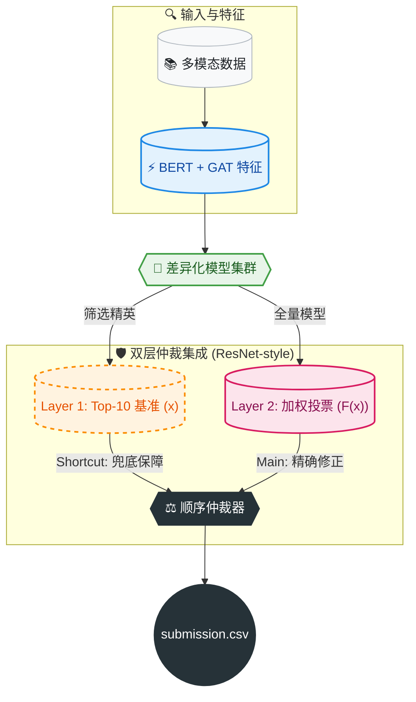

# 📚 基于仲裁式双层集成的智能借阅推荐系统
# (Arbitration-based Two-Layer Ensemble Recommendation System)


> 🏆 **决赛核心方案**: 本项目针对跨模态数据融合、用户冷启动及多模型集成中“概率分布不一致”的核心挑战，创新性地提出了**“加权投票为主、顺序仲裁为辅”**的双层集成框架。系统引入 **ResNet 残差思想** 解决集成退化问题，底层结合 **BERT** 与 **GAT** 深度挖掘图文特征，最终实现高精度的图书借阅推荐。

---

## 📖 目录 (Table of Contents)

- [核心创新 (Key Innovations)](#-核心创新-key-innovations)
- [系统架构 (System Architecture)](#-系统架构-system-architecture)
- [技术深度解析 (Technical Deep Dive)](#-技术深度解析-technical-deep-dive)
    - [双层集成机制 (Two-Layer Ensemble)](#1-双层集成机制-two-layer-ensemble)
    - [ResNet 残差抗退化设计 (ResNet Anti-Degradation)](#2-resnet-残差抗退化设计-resnet-anti-degradation)
    - [多模态特征挖掘 (Multi-Modal Mining)](#3-多模态特征挖掘-multi-modal-mining)
- [快速开始 (Quick Start)](#-快速开始-quick-start)
- [仓库结构 (Repository Layout)](#-仓库结构-repository-layout)
- [完整复现 (Full Reproduction)](#-完整复现-full-reproduction)
- [注意事项 (Notes)](#-注意事项-notes)

---

## ✨ 核心创新 (Key Innovations)

*   **🛡️ 双层仲裁集成 (Two-Layer Arbitration Ensemble)**
    *   **Layer 1 (鲁棒性)**: 精英模型 Top-10 预融合，构建高置信度基准。
    *   **Layer 2 (精确性)**: 全量模型加权投票 + **顺序仲裁机制**，解决平票与分布差异问题。
*   **🧬 ResNet 残差思想 (ResNet-Inspired)**
    *   构建 $H(x) = F(x) + x$ 的集成范式。以 Layer 1 结果为恒等映射 ($x$)，Layer 2 为残差修正 ($F(x)$)，确保集成效果**单调不减**，解决“越集成越退化”的悖论。
*   **🧠 多模态深度挖掘 (Deep Multi-Modal Mining)**
    *   引入 **BERT** 提取文本语义，利用 **GAT (图注意力网络)** 捕捉用户-书籍交互图结构，突破传统统计特征的瓶颈。

---

## 🛠️ 系统架构 (System Architecture)

本方案采用“漏斗式”决策流，从底层特征挖掘到上层仲裁决策，层层递进：



---

## 🔍 技术深度解析 (Technical Deep Dive)

### 1. 双层集成机制 (Two-Layer Ensemble)
为解决模型输出概率分布不一致和平票问题，我们构建了严格的双层机制：

*   **Layer 1：构建高可靠性基准 (Reliable Baseline)**
    *   采用“**文件内标准化 + 跨文件动态加权**”技术。
    *   消除不同模型量纲差异，确保精英模型结果在统一标准下融合，实现自校正。
*   **Layer 2：多模型加权仲裁 (Weighted Arbitration)**
    *   读取所有子模型与 Layer 1 产出进行加权投票。
    *   **仲裁机制**：当出现得分并列时，严格依据**模型优先级索引**进行仲裁，确保结果的唯一性与可复现性。

### 2. ResNet 残差抗退化设计 (ResNet Anti-Degradation)
针对集成学习中引入弱模型可能导致效果下降的“退化悖论”，我们复刻了 ResNet 的核心思想：

> **公式**: $H(x) = F(x) + x$

*   **$x$ (恒等基准)**: 由 Layer 1 精英模型结果构成，相当于 ResNet 的 Shortcut，提供**性能下界兜底**。
*   **$F(x)$ (残差修正)**: 由 Layer 2 全量模型投票构成，旨在捕捉额外的增量信息。
*   **价值**: 这种设计赋予系统“敢于加深”的底气。即使 Layer 2 引入了噪声，Layer 1 的存在也能保证最终效果不低于单体精英模型。

### 3. 多模态特征挖掘 (Multi-Modal Mining)
推荐系统的上限由特征决定。我们超越传统机器学习，引入深度学习特征：
*   **BERT**: 提取书籍简介、评论的深层语义特征。
*   **GNN (图神经网络)**: 构建“用户-书籍”异构图，利用 GAT 捕捉高阶协同过滤信号，解决冷启动问题。

---

## 🚀 快速开始 (Quick Start)

在 **项目根目录** 下运行以下命令即可生成最终提交文件：

```bash
python FINAL加权.py
```

*   **输出**: `submission.csv`
*   **注意**: 脚本依赖各子目录的中间产物，如果是首次运行，请参考下方的“完整复现”。

---

## 📂 仓库结构 (Repository Layout)

```text
.
├── 📜 FINAL加权.py                # 🔥 Layer 2 核心：最终仲裁与加权脚本 -> submission.csv
├── 📜 Top10加权融合.py            # �️ Layer 1 核心：Top-10 基准生成 -> top10加权输出结果.csv
├── 📜 整合rv5到最终投票.py         # � 辅助：v5 模型结果标准化
├── 📂 23混推/                     # 🧠 子模型：混合推荐策略
├── 📂 v5/                        # 🧠 子模型：v5 版本
├── 📂 dspos2/                    # 🧠 子模型：dspos2 版本
├── 📂 133/                       # 🧠 子模型：133 版本
├── 📂 f1/                        # 🧠 子模型：f1 版本
├── 📂 v2/                        # 🧠 子模型：v2 版本
├── 📂 决赛classic_autoML/        # 🧠 子模型：AutoML 策略
└── 📝 环境依赖.txt                 # 📦 依赖说明
```

---

## 🔄 完整复现 (Full Reproduction)

### 1. 子模型生成 (Per-model Inference)
进入以下每个文件夹，按照其内部 README 运行，生成各自的 CSV 产物：
> `23混推` / `v5` / `dspos2` / `133` / `f1` / `v2` / `决赛classic_autoML`

### 2. 执行双层集成 (Execute Ensemble)

```bash
# Step 1: 准备 v5 结果 (Layer 1 预处理)
python 整合rv5到最终投票.py

# Step 2: 生成 Layer 1 基准 (Top-10 加权)
# 对应理论中的 "x" (Shortcut)
python Top10加权融合.py

# Step 3: 执行 Layer 2 最终仲裁 (Final Arbitration)
# 对应理论中的 "H(x) = F(x) + x"
python FINAL加权.py
```

---

## ⚠️ 注意事项 (Notes)

*   **数据路径**: 请确保 `1data.csv` (复赛) 和 `111data.csv` (决赛) 放置在正确位置。
*   **运行目录**: 所有 Python 脚本必须在 **项目根目录** 执行。
*   **大文件**: 模型权重文件 (`.pkl`, `.joblib`) 未上传 Git，如需完整离线包请联系 `a1992423911@dlmu.edu.cn`。

---

<p align="center">
  <i>Powered by <b>Arbitration-based Ensemble Strategy</b></i>
</p>
