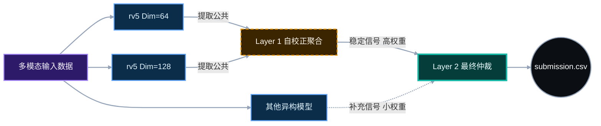

# 📚 基于仲裁式双层集成的智能借阅推荐系统
# (Arbitration-based Two-Layer Ensemble Recommendation System)


> 🏆 **决赛核心方案**: 本项目创新性地构建了**“双层加权投票仲裁架构”**。Layer 1 负责概率校准与子模型自校正，输出高质量基准；Layer 2 作为最终决策层，通过加权投票与顺序仲裁，为每个用户选出唯一且稳定的 Top-1 推荐。该方案完美解决了异构模型概率分布不一致的问题，实现了推荐准确率的稳步提升。

---

## 📖 目录 (Table of Contents)

- [方案总览 (Overview)](#-方案总览-overview)
- [核心设计理念 (Core Design Philosophy)](#-核心设计理念-core-design-philosophy)
    - [Layer 1: 自校正 (Self-Calibration)](#1-layer-1-自校正-self-calibration)
    - [Layer 2: 抗退化仲裁 (Anti-Degradation Arbitration)](#2-layer-2-抗退化仲裁-anti-degradation-arbitration)
    - [跨模型概率可比性校准 (Cross-Model Calibration)](#3-跨模型概率可比性校准-cross-model-calibration)
- [系统架构 (System Architecture)](#-系统架构-system-architecture)
- [快速开始 (Quick Start)](#-快速开始-quick-start)
- [仓库结构 (Repository Layout)](#-仓库结构-repository-layout)
- [完整复现 (Full Reproduction)](#-完整复现-full-reproduction)
- [注意事项 (Notes)](#-注意事项-notes)

---

## 🗺️ 方案总览 (Overview)

针对赛题中跨模态特征提取困难、冷启动问题显著以及多模型融合尺度不一的核心挑战，本项目提出了**“加权投票为主、顺序仲裁为辅”**的双层集成框架：

*   **Layer 1 (概率校准)**: 子模型自校准，负责输出高质量的子模型。
*   **Layer 2 (最终决策)**: 通过加权投票，为每个用户选出唯一且稳定的 Top-1 推荐。
*   **协同机制**: Layer 1 层与 Layer 2 加权决策仲裁层的双层协同，实现对用户借阅行为的准确稳定预测。

---

## 🧠 核心设计理念 (Core Design Philosophy)

### 1. Layer 1: 自校正 (Self-Calibration)
**—— 寻找变化中的“不变量”**

*   **问题发现**: 在开发 `rv5` 系列模型时，我们发现**改变文本嵌入维度**（Text Embedding Dimension），最终生成的预测结果会有波动。
*   **自纠正策略**: 我们不依赖单一参数模型，而是将不同维度的变体放入 Layer 1 进行**自纠正**。
*   **具体实现**:
    *   通过不断提取不同变体之间的**公共推荐（Intersection）**，赋予这些稳定部分极高的权重。
    *   找到在不断参数变化中，仍然保持不变的稳定推荐。
*   **价值**: 这种机制提升了 Layer 2 在加入新模型时的抗干扰能力，为最终投票提供了坚实的“稳定部分”。

### 2. Layer 2: 抗退化仲裁 (Anti-Degradation Arbitration)
**—— ResNet 式的“跳连不伤主干”**

Layer 2 作为最终决策层，核心目标是确保在引入新模型时，系统性能**单调不减**。

*   **稳定提升逻辑 (补充发现)**:
    *   差异化模型主要提供“补充发现”。
    *   即使某个新模型整体表现较差，但它预测正确的**好的样本**会因权重叠加被筛选出来。
    *   预测错误的**差的样本**因权重小或不被多数模型支持，最终不被采纳。
*   **抗退化性质**:
    *   类似于 **ResNet 的跳连结构 (Skip Connection)**。
    *   新增模型用**小权重**进入体系，其错误影响被上限约束（不会破坏主干）。
    *   只有当该模型在某些特定 User-Book 对上显著有益时，才会提升总分。
*   **结果**: 这种机制让我们后续更多的工作量（加入新模型）**不会导致模型性能的退化**，基本分数都是不断提升。

### 3. 跨模型概率可比性校准 (Cross-Model Calibration)
**—— 解决“概率不可比”痛点**

*   **核心痛点**: 异构模型（如 GNN vs GBDT）输出的概率分布存在显著差异。若直接融合原始概率，会导致高置信度模型（往往是“过自信”的）掩盖其他模型的有效信号，损失多样性与互补性。
*   **技术解决方案**:
    1.  **文件内标准化**: 对子模型预测结果进行标准化，消除模型内部的尺度差异。
    2.  **跨模型权重融合**: 基于验证集性能计算模型权重，只对预测结果进行加权融合，**不再考虑单一模型的置信概率**。
*   **效果**: 确保了所有模型在公平的跑道上竞争，充分吸收各子模型的优势特征，避免单一模型主导决策，显著提升了集成系统的泛化能力与鲁棒性。

---

## 🛠️ 系统架构 (System Architecture)



---

## 🚀 快速开始 (Quick Start)

在 **项目根目录** 下运行以下命令即可生成最终提交文件：

```bash
python FINAL加权.py
```

*   **输出**: `submission.csv`
*   **注意**: 脚本依赖各子目录的中间产物，如果是首次运行，请参考下方的“完整复现”。

---

## 📂 仓库结构 (Repository Layout)

```text
.
├── 📜 FINAL加权.py                # 🔥 Layer 2 核心：最终仲裁与加权脚本 -> submission.csv
├── 📜 Top10加权融合.py            # 🛡️ Layer 1 核心：Top-10 基准生成 -> top10加权输出结果.csv
├── 📜 整合rv5到最终投票.py         # 🔧 Layer 1 核心：rv5 自校正与标准化 -> 七以上的v5.csv
├── 📂 23混推/                     # 🧠 子模型：混合推荐策略
├── 📂 v5/                        # 🧠 子模型：v5 系列 (含自校正逻辑)
├── 📂 dspos2/                    # 🧠 子模型：dspos2 版本
├── 📂 133/                       # 🧠 子模型：133 版本
├── 📂 f1/                        # 🧠 子模型：f1 版本
├── 📂 v2/                        # 🧠 子模型：v2 版本
├── 📂 决赛classic_autoML/        # 🧠 子模型：AutoML 策略
└── 📝 环境依赖.txt                 # 📦 依赖说明
```

---

## 🔄 完整复现 (Full Reproduction)

### 1. 子模型生成 (Per-model Inference)
进入以下每个文件夹，按照其内部 README 运行，生成各自的 CSV 产物：
> `23混推` / `v5` / `dspos2` / `133` / `f1` / `v2` / `决赛classic_autoML`

### 2. 执行双层集成 (Execute Ensemble)

```bash
# Step 1: Layer 1 自校正 (Self-Correction)
# 对 rv5 系列进行内部加权与标准化，提取稳定信号
python 整合rv5到最终投票.py

# Step 2: 准备基准数据
# 生成 Top-10 辅助基准
python Top10加权融合.py

# Step 3: Layer 2 最终仲裁 (Final Arbitration)
# 全量模型标准化 + 加权投票 + 顺序仲裁
python FINAL加权.py
```

---

## ⚠️ 注意事项 (Notes)

*   **数据路径**: 请确保 `1data.csv` (复赛) 和 `111data.csv` (决赛) 放置在正确位置。
*   **运行目录**: 所有 Python 脚本必须在 **项目根目录** 执行。
*   **大文件**: 模型权重文件 (`.pkl`, `.joblib`) 未上传 Git，如需完整离线包请联系 `a1992423911@dlmu.edu.cn`。

---

<p align="center">
  <i>Powered by <b>Arbitration-based Ensemble Strategy</b></i>
</p>
