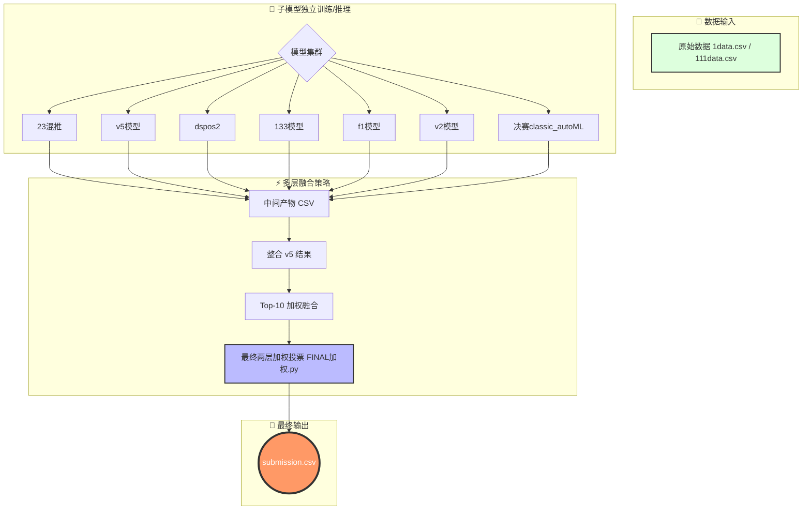

# 📚 全球 AI 算法挑战赛 — 图书馆多模型推荐系统
# (Multi-Model Library Recommendation)


> 🏆 **决赛方案**: 这是一个生产级的多模型融合推荐系统。我们采用独立的子模型训练策略，并通过两层加权投票机制（Two-Layer Weighted Voting）融合各模型结果，最终生成高精度的图书借阅推荐。

---

## 📖 目录 (Table of Contents)

- [核心亮点 (Highlights)](#-核心亮点-highlights)
- [架构流程 (Architecture)](#-架构流程-architecture)
- [快速开始 (Quick Start)](#-快速开始-quick-start)
- [仓库结构 (Repository Layout)](#-仓库结构-repository-layout)
- [完整复现步骤 (Full Reproduction)](#-完整复现步骤-full-reproduction)
- [数据说明 (Data & Inputs)](#-数据说明-data--inputs)
- [注意事项 (Notes & Troubleshooting)](#-注意事项-notes--troubleshooting)

---

## ✨ 核心亮点 (Highlights)

*   **🧩 多模型流水线 (Multi-model Pipeline)**
    *   每个子文件夹（如 `v5`, `23混推` 等）包含独立的训练与推理流程，模块化程度高，互不干扰。
*   **⚖️ 两层加权投票 (Two-layer Weighted Voting)**
    *   独特的两阶段融合策略，有效结合了不同模型的优势，显著提升了结果的鲁棒性和准确性。
*   **🔄 全链路复现 (Full Reproduction)**
    *   提供完整的复现路径，每个子模型均有详细的独立文档说明。

---

## 🛠️ 架构流程 (Architecture)

为了更好地理解系统工作流，以下是核心处理逻辑的示意图：



---

## 🚀 快速开始 (Quick Start)

在 **项目根目录** 下运行以下命令即可生成最终提交文件：

```bash
python FINAL加权.py
```

*   **输出**: `submission.csv`
*   **注意**: 所有脚本均设计为在项目根目录下运行，请勿切换到子目录执行根目录脚本。

---

## 📂 仓库结构 (Repository Layout)

清晰的文件结构有助于您快速定位核心代码：

```text
.
├── 📜 FINAL加权.py                # 🔥 核心：最终两层加权投票脚本 -> submission.csv
├── 📜 Top10加权融合.py            # 🔨 核心：Top-10 加权融合脚本 -> top10加权输出结果.csv
├── 📜 整合rv5到最终投票.py         # 🔨 核心：v5 结果整合脚本 -> 七以上的v5.csv
├── 📂 23混推/                     # 🧠 子模型：混合推荐策略
├── 📂 v5/                        # 🧠 子模型：v5 版本
├── 📂 dspos2/                    # 🧠 子模型：dspos2 版本
├── 📂 133/                       # 🧠 子模型：133 版本
├── 📂 f1/                        # 🧠 子模型：f1 版本
├── 📂 v2/                        # 🧠 子模型：v2 版本
├── 📂 决赛classic_autoML/        # 🧠 子模型：AutoML 策略
├── 📝 整体README帮助理解.txt       # 📘 辅助文档
└── 📝 环境依赖.txt                 # 📦 依赖说明
```

---

## 🔄 完整复现步骤 (Full Reproduction)

如果您需要从头复现所有结果，请严格遵循以下步骤：

### 1. 子模型生成 (Per-model outputs)
进入以下每个文件夹，按照其内部的 `README` 说明运行，生成各自的 CSV 产物：
> `23混推` / `v5` / `dspos2` / `133` / `f1` / `v2` / `决赛classic_autoML`

### 2. 回到根目录进行融合 (Fusion)

```bash
# 步骤 2: 整合 v5 结果
# 作用：将 v5 模型的预测结果整合到统一格式
python 整合rv5到最终投票.py
# -> 生成: 七以上的v5.csv

# 步骤 3: Top-10 加权融合
# 作用：对表现最好的 Top-10 结果进行加权
python Top10加权融合.py
# -> 生成: top10加权输出结果.csv

# 步骤 4: 最终两层加权投票
# 作用：生成最终提交文件
python FINAL加权.py
# -> 生成: submission.csv
```

---

## 📊 数据说明 (Data & Inputs)

| 文件名 | 说明 | 备注 |
| :--- | :--- | :--- |
| `1data.csv` | 复赛数据 | 用于部分模型的验证与训练 |
| `111data.csv` | 决赛数据 | 最终预测的目标数据集 |

> **⚠️ 重要**: 许多子模型文件夹内包含了自己的数据副本。请严格按照各文件夹内的 README 指引放置数据文件。

---

## ⚠️ 注意事项 (Notes & Troubleshooting)

### 💾 关于大文件
*   **模型文件与中间产物**: 最终决赛提交的模型文件、过程 CSV 产物均已线下保存。
*   **Git 限制**: 由于 GitHub 文件大小限制，`.joblib`, `.pkl`, `.csv` 等大型二进制文件 **未上传** 到此仓库。
*   **获取完整包**: 如需完整复现包（包含所有大文件），请联系邮箱：`a1992423911@dlmu.edu.cn`。

### 🔧 常见问题
1.  **路径错误**: 必须在 **项目根目录** 运行根目录下的 `.py` 脚本，否则相对路径会报错。
2.  **数据缺失**: 如果脚本提示找不到数据，请检查 `1data.csv` / `111data.csv` 位置是否正确。
3.  **编码问题**: 项目统一使用 `UTF-8` 编码。如果遇到乱码，请检查您的编辑器设置或输入文件编码。

---

## 📜 许可证 (License)

本项目代码供学习交流使用。

---

<p align="center">
  <i>Created with ❤️ by the Algorithm Team</i>
</p>
